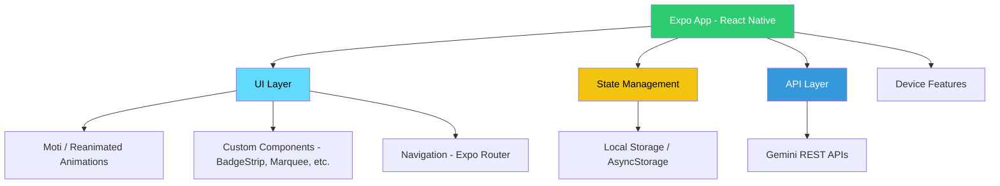

<div align="center">


# ProductAI (Assessment by CanvasAI)

### AI-Powered Product Suggestion
</div>
  
<p align="center">
  <strong>Transform your product discovery with intelligent AI insights</strong><br>
  Automated catalog analysis • Real-time suggestions • Seamless Gemini API integration
</p>
  
<p align="center">
  <a href="#-introduction">🎯 Introduction</a> •
  <a href="#-features">✨ Features</a> •
  <a href="#-architecture">🏗️ Architecture</a> •
  <a href="#-tech-stack">🛠️ Tech Stack</a> •
  <a href="#-quick-start">🚀 Quick Start</a> •
  <a href="#-future-prospects-v30">🌟 Future Prospects</a> •
  <a href="#-acknowledgments">🙏 Acknowledgments</a>
</p>

---

## 🎯 Introduction

This project leverages the **Gemini REST API** to analyze product catalogs and generate the best matches along with AI-powered top picks based on user prompts.  
It also includes advanced filters to help users refine their search results, as well as predefined prompts to make it easier for new users to explore and get familiar with the system.

---

## ✨ Features

<table>
  <tr>
    <td>
      
      <h3>📱 Cross-Platform Support</h3>
      <p>Runs seamlessly on both Android and iOS with a single Expo codebase.</p>
    </td>
    <td>
      
      <h3>✨ Animations and Gradients</h3>
      <p>Powered by Moti for fluid transitions, parallax effects, and interactive motion components.</p>
    </td>
  </tr>
  <tr>
    <td>
      
      <h3>🔗 Gemini Integration</h3>
      <p>Connects with REST/GraphQL API of Gemini to filter and suggest the best products from the catalog.</p>
    </td>
    <td>
      
      <h3>⚡ Ready-to-Use Prompts</h3>
      <p>Includes predefined prompts in different categories for users to quickly try and explore.</p>
    </td>
  </tr>
</table>

---

## 🏗️ Architecture



---

## 🛠️ Tech Stack

### Frontend
- **Framework**:React Native (Expo SDK 51+) with TypeScript
- **Styling**: Tailwind CSS + Nativewind
- **Navigation**: Expo Router
- **Icons**: Expo Native icons
- **Animations**: Moti
- **Mobile Bundling**: EAS Build & EAS Submit (Expo Application Services)
- **OTA Updates**: Expo Updates

---

## 🚀 Quick Start


### Prerequisites
- **Node.js** 18+ with npm/pnpm/yarn
- **Expo CLI** (`npm install -g expo-cli`)

---
<!-- 
### Installation

1. **Clone the repository**
   ```bash
   git clone https://github.com/your-username/previwer.git
   cd productAI
   ```

2. **Install dependencies**
   ```bash
   npm install
   ```

3. **Environment Configuration**

   Create `.env` files in both `backend` and `frontend` directories:

   **Backend `.env`:**
   ```env
   GEMINI_API_KEY = "your_gemini_api_keu"
   ```

4. **Run the application**
   ```bash
   # Start Expo development server
   npx expo start

   # Start Expo development server (android)
   npx expo start:android

   # Start Expo development server (ios)
   npx expo start:ios

   # Start Expo development server (with cleared cache)
   npx expo start --clear
   ```
--- -->


## 🌟 Future Prospects (v3.0)
1. **🤖 AI Playground**
   - Allow users to experiment with **custom LLMs**, system prompts, and fine-tuned configurations.  
   - Add a live **chat/playground interface** for testing prompts.

2. **👤 User Login & Authentication**
   - Implement **secure authentication** using Google/GitHub OAuth or email-password.  
   - Role-based access (admin, premium user, free user).  
   - Secure token handling with **JWT + Refresh tokens**.

3. **💳 Paid / Free Tier Architecture**
   - Introduce a **subscription model** with free and premium features.  
   - Integrate with **Stripe/Razorpay** for in-app purchases and billing.  
   - Rate limiting & feature gating for free users.

4. **🗄️ Real Backend & Database Integration**
   - Move from mock data to a **production-ready backend** with **Node.js/Express** or **Nest.js**.  
   - Store structured data in **MongoDB/PostgreSQL**.  
   - Use **Redis** for caching, notifications, and faster performance.  
   - Enable **real-time sync** with WebSockets (e.g., Socket.IO).


##  Acknowledgments

- **Gemini** for providing excellent models and Rest APIs

---

<div align="center">
  <p>
    <strong>Made with ⚡ by Shobhit Tiwari</strong>
  </p>
  <p>
    <a href="https://github.com/Shobhit141141/previwer">🌟 on GitHub</a>
  </p>
</div>
